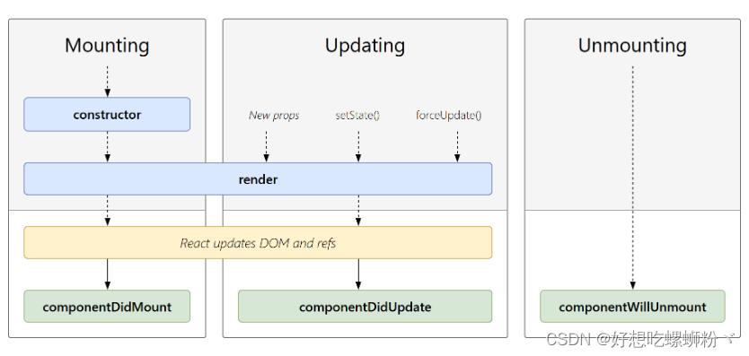
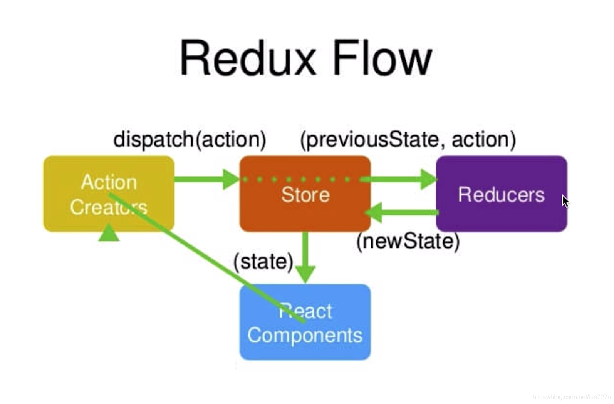

# React

## create-react-app

## React jsx语法
   JSX 是一个看起来很像 XML 的 JavaScript 语法扩展.
   - JSX 执行更快，因为它在编译为 JavaScript 代码后进行了优化。
   - 它是类型安全的，在编译过程中就能发现错误。
   - 使用 JSX 编写模板更加简单快速。

## React 状态（state）
   - 通过与用户的交互，实现不同状态，然后渲染 UI，让用户界面和数据保持一致。
## React props
   - state 和 props 主要的区别在于 props 是不可变的，而 state 可以根据与用户交互来改变。这就是为什么有些容器组件需要定义 state 来更新和修改数据。 而子组件只能通过 props 来传递数据。

## React 事件处理
   React 元素的事件处理和 DOM 元素类似。但是有一点语法上的不同:
   - React 事件绑定属性的命名采用驼峰式写法，而不是小写。
   - 如果采用 JSX 的语法你需要传入一个函数作为事件处理函数，而不是一个字符串(DOM 元素的写法)

## React 组件 API
   - 设置状态：setState
   > setState(object nextState[, function callback])
   - 替换状态：replaceState
   > replaceState(object nextState[, function callback])
   - 设置属性：setProps
   > setProps(object nextProps[, function callback])
   - 替换属性：replaceProps
   > replaceProps(object nextProps[, function callback])
   - 强制更新：forceUpdate
   > forceUpdate([function callback])
   - 获取DOM节点：findDOMNode
   > DOMElement findDOMNode()
   - 判断组件挂载状态：isMounted
   > bool isMounted()

## React类组件
   ###  React 组件生命周期
   
   **挂载** 
   当组件实例被创建并插入 DOM 中时，其生命周期调用顺序如下：
   - constructor(): 在 React 组件挂载之前，会调用它的构造函数。
   - getDerivedStateFromProps(): 在调用 render 方法之前调用，并且在初始挂载及后续更新时都会被调用。
   - render(): render() 方法是 class 组件中唯一必须实现的方法。
   - componentDidMount(): 在组件挂载后（插入 DOM 树中）立即调用
   > render() 方法是 class 组件中唯一必须实现的方法，其他方法可以根据自己的需要来实现。
    **更新**
   每当组件的 state 或 props 发生变化时，组件就会更新。
   当组件的 props 或 state 发生变化时会触发更新。组件更新的生命周期调用顺序如下：
   - getDerivedStateFromProps(): 在调用 render 方法之前调用，并且在初始挂载及后续更新时都会被调用。根据 shouldComponentUpdate() 的返回值，判断 React 组件的输出是否受当前 state 或 props 更改的影响。
   - shouldComponentUpdate():当 props 或 state 发生变化时，shouldComponentUpdate() 会在渲染执行之前被调用。
   - render(): render() 方法是 class 组件中唯一必须实现的方法。
   - getSnapshotBeforeUpdate(): 在最近一次渲染输出（提交到 DOM 节点）之前调用。
   - componentDidUpdate(): 在更新后会被立即调用。
   >render() 方法是 class 组件中唯一必须实现的方法，其他方法可以根据自己的需要来实现。
   **卸载**
   当组件从 DOM 中移除时会调用如下方法：
   - componentWillUnmount(): 在组件卸载及销毁之前直接调用。

## React函数组件
   ### hooks-useState
   ### hooks-useEffect
   ### hooks-useCallback
   ### hooks-useMemo
   ### hooks-useRef
   ### hooks-useContext
   ### hooks-useReducer

## React Router
   ### 一级路由和多级路由
   ### 路由重定向
   ### 嵌套路由
   ### 声明式导航和编程式导航
   ### 动态路由
   ### 路由拦截
   ### 路由模式
   ### withRouter

## React 父子通信

## React 非父子通信

## React 插槽

## React Redux
   ### state：驱动应用的真实数据源头
   ### view：基于当前状态的 UI 声明性描述
   ### actions：根据用户输入在应用程序中发生的事件，并触发状态更新
   ### redux和reducer合并
   ### redux中间件-redux-thunk--用最简单的方式搭建异步 action 构造器
   ### redux中间件-redux-promise
   ### redux持久化
   
   
   
   

## React axios
   ### 反向代理

## antd UI框架
